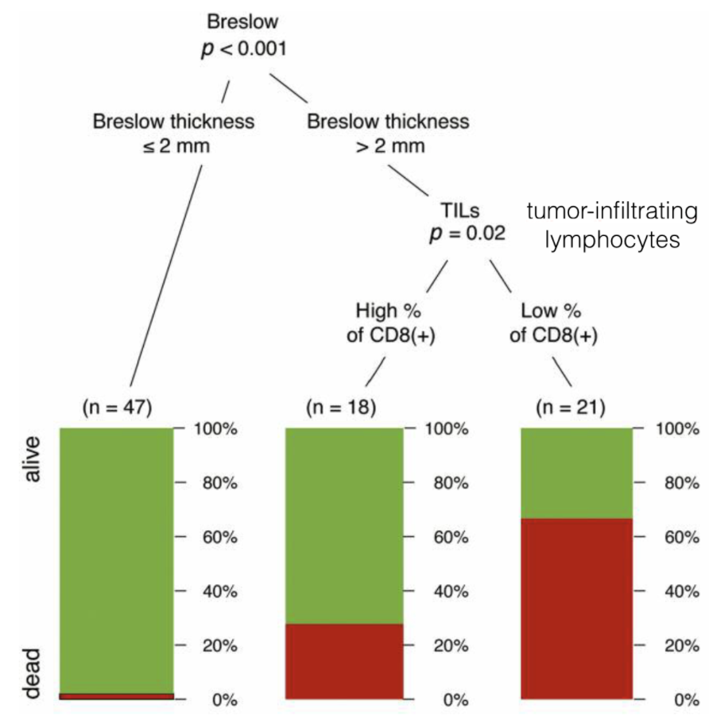
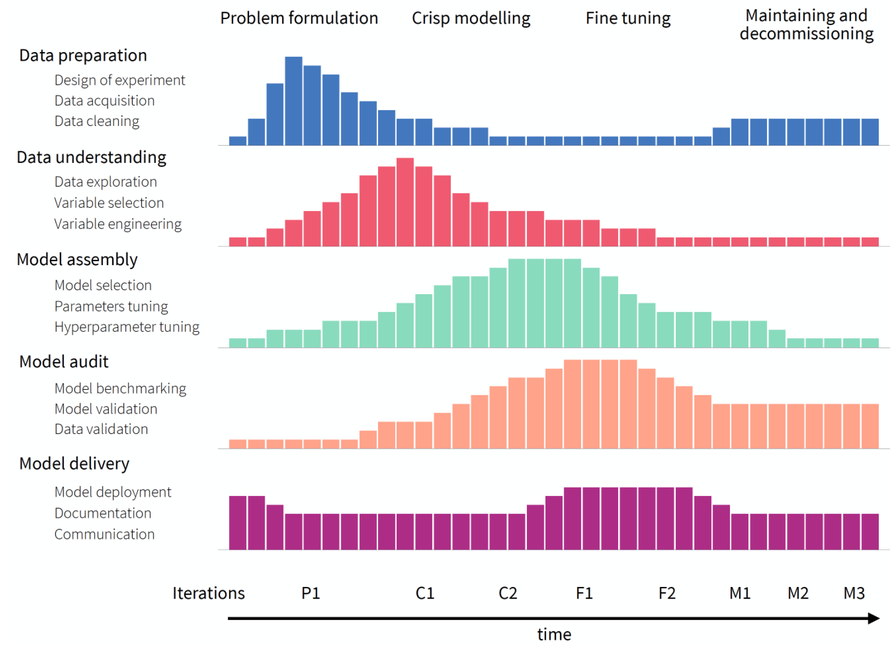

# Introduction

# Baseline workflow

This section serves as a synthesis of all notes and presents the most basic approach and set of concrete steps that can be used for validation of any model:

1) Correlation analysis (numerical vs. other feature **types**)
2) ...

## Three laws of model explanation

1) **Prediction’s validation:** for every prediction of a model, one should be able to verify how strong is the evidence that supports the prediction.
   
2) **Prediction’s justification:** for every prediction of a model, one should be able to understand which variables affect the prediction and to what extent.
   
3) **Prediction’s speculation:** for every prediction of a model, one should be able to understand how the prediction would change if the values of the variables included in the model changed.

 

Let's illustrate the these laws with this practical tree model example:

* regarding _prediction’s validation_, we see how many patients fall in a given category in each node
* with respect to _prediction’s justification_, we know which explanatory variables are used in every decision path
* regarding _prediction’s speculation_, we can trace how will changes in particular variables affect the model’s prediction

## Black-box vs. Glass-box (White-box) models

1) **Black-box:** is used for models with a complex structure that is hard to understand by humans. This usually refers to a large number of model coefficients or complex mathematical transformations. As people vary in their capacity to understand complex models, there is no strict threshold for the number of coefficients that makes a model a black-box. In practice, for most people, this threshold is probably closer to 10 than to 100.

2) **Glass-box:**  is used for models easy to understand (though maybe not by every person). It has a simple structure and a limited number of coefficients.

Examples of glass-box models are:
* linear regression
* logistic regression
* GLM, GAM and more
* decision tree
* decision rules
* RuleFit algorithm
* Naive Bayes
* K-Nearest Neighbors

## Model-specific vs. Model-agnostic methods

"(...) this variety of model-specific approaches does lead to issues, though. For instance, one cannot easily compare explanations for two models with different structures. Also, every time a new architecture or a new ensemble of models is proposed, one needs to look for new methods of model exploration. Finally, no tools for model explanation or diagnostics may be immediately available for brand-new models.

"(...) for these reasons, we prefer not to assume anything about the model structure, as we may be dealing with a black-box model with an unspecified structure. Note that often we do not have access to model coefficients, but only to a specified Application Programming Interface (API) that allows querying remote models as, for example, in Microsoft Cognitive Services (Azure 2019). In that case, the only operation that we may be able to perform is the evaluation of a model on a specified set of data."
 
## Model development

* purpose of the model: inferential/ statistical modelling vs. predictive modelling - depending on the purpose there are important consequences for the methods used in the model development process

* the traditional CRISP-DM model building process (MBP):
  * business understanding
  * data understanding
  * data preparation
  * modelling
  * evaluation
  * deployment 

* the new MBP process proposed by Biecek: it recognizes that fact that consecutive iterations are not identical because the knowledge increases during the process and consecutive iterations are performed with different goals in mind

  * the process is split into five different phases (rows)
  * the process is split into four stages (indicated at the top of the diagram)
  * horizontal axis presents the time from the problem formulation to putting the model into practice (decommissioning)
  * for a particular phase, resources can be used in different amounts depending on the current stage of the process, as indicated by the height of the bars
  * there may be several iterations of different phases within each stage, as indicated at the bottom of the diagram

 

# EMA (Explanatory Model Analysis)

## Quantitative methods

### Global (model-based)

Help to understand how do the model predictions perform overall, for an entire set of observations. The following examples illustrate situations in which dataset-level explainers may be useful:

* we may want to learn which variables are “important” in the model. For instance, we may be interested in predicting the risk of heart attack by using explanatory variables that are derived from the results of medical examinations. If some of the variables do not influence predictions, we could simplify the model by removing the variables

* we may want to understand how does a selected variable influence the model’s predictions? For instance, we may be interested in predicting prices of apartments. Apartment’s location is an important factor, but we may want to know which locations lead to higher prices?

* we may want to discover whether there are any observations, for which the model yields wrong predictions. For instance, for a model predicting the probability of survival after a risky treatment, we might want to know whether there are patients for whom the model’s predictions are extremely wrong. Identifying such a group of patients might point to, for instance, an incorrect form of an explanatory variable, or even a missed variable

* we may be interested in an overall “performance” of the model. For instance, we may want to compare two models in terms of the average accuracy of their predictions

___

**Model performance metrics**

There were many individual metrics presented for different types of target variables. I won't note them down in details, and just made some general notes from the chapter.

* goodness-of-fit (GoF) - mainly used for explanatory models (how well do the model’s predictions explain (fit) dependent-variable values of the observations used for developing the model)

* goodness-of-prediction(GoP) - mainly applied for predictive models (how well does the model predict the value of the dependent variable for a new observation)

"(...) it is worth mentioning that there are two important aspects of prediction: **calibration and discrimination**. Calibration refers to the extent of bias in predicted values, i.e., the mean difference between the predicted and true values. Discrimination refers to the ability of the predictions to distinguish between individual true values. For instance, consider a model to be used for weather forecasts in a region where, on average, it rains half a year. A simple model that predicts that every other day is rainy is well-calibrated because, on average, the resulting predicted risk of a rainy day in a year is 50%, which agrees with the actual situation. However, the model is not very much discriminative (for each calendar day, the probability of a correct prediction is 50%, the same as for a fair-coin toss) and, hence, not very useful. Thus, in addition to overall measures of GoP, **we may need separate measures for calibration and discrimination of a model**. Note that, for the latter, we may want to weigh differently the situation when the prediction is, for instance, larger than the true value, as compared to the case when it is smaller. Depending on the decision on how to weigh different types of disagreement, we may need different measures"

___

**Feature importance**

The proposed approach for measuring model-agnostic variable importance (applicable for any model and that can be used for making between-model comparisons) is called **permutation importance**.

**Idea:** to measure how much does a model’s performance change if the effect of a selected explanatory variable, or of a group of variables, is removed? To remove the effect, we use perturbations, like resampling from an empirical distribution or permutation of the values of the variable. If a variable is important, then we expect that, after permuting the values of the variable, the model’s performance will worsen. The larger the change in the performance, the more important is the variable.

> NOTE: the use of resampling or permuting data involves randomness. Thus, the results of the procedure may depend on the obtained configuration of resampled/permuted values. Hence, it is advisable to repeat the procedure several (many) times. In this way, the uncertainty associated with the calculated variable-importance values can be assessed.

1) Pros:

* model-agnostic
* works for every variable type
* easy to understand
* measures can be compared between models
* can be used to measure the importance of a single explanatory variable or a group of variables (e.g. groups of variables that are complementary to each other or are related to a similar concept)

> NOTE: if variables are correlated, then models like random forest are expected to spread importance across many variables, while in regularized-regression models the effect of one variable may dominate the effect of other correlated variables

2) Cons:

* its dependence on the random nature of the permutations (different results for different permutations)
* the value of the measure depends on the choice of the loss function, thus, there is no single, “absolute” measure 

___

**Partial dependence profiles (PD plots)**

**Idea:** to show how does the expected value of model prediction behave as a function of a selected explanatory variable? For a single model, one can construct an overall PD profile by using all observations from a dataset, or several profiles for sub-groups of the observations. Comparison of sub-group-specific profiles may provide important insight into, for instance, the stability of the model’s predictions. To show how does the expected value of model prediction behave as a function of a selected explanatory variable, the average of a set of individual ceteris-paribus (CP) profiles can be used. Recall that a CP profile shows the dependence of an instance-level prediction on an explanatory variable. A PD profile is estimated by the mean of the CP profiles for all instances (observations) from a dataset.

PD profiles are also useful for comparisons of different models:

* _Agreement between profiles for different models is reassuring_: some models are more flexible than others. If PD profiles for models, which differ with respect to flexibility, are similar, we can treat it as a piece of evidence that the more flexible model is not overfitting and that the models capture the same relationship.
  
* _Disagreement between profiles may suggest a way to improve a model_: if a PD profile of a simpler, more interpretable model disagrees with a profile of a flexible model, this may suggest a variable transformation that can be used to improve the interpretable model. For example, if a random forest model indicates a non-linear relationship between the dependent variable and an explanatory variable, then a suitable transformation of the explanatory variable may improve the fit or performance of a linear-regression model.

* _Evaluation of model performance at boundaries_: models are known to have different behavior at the boundaries of the possible range of a dependent variable, i.e., for the largest or the lowest values. For instance, random forest models are known to shrink predictions towards the average, whereas support-vector machines are known for a larger variance at edges. Comparison of PD profiles may help to understand the differences in models’ behavior at boundaries.

**PD variations:**

* _Clustered partial-dependence profiles:_ the mean of CP profiles is a good summary if the profiles are parallel. If they are not parallel, the average may not adequately represent the shape of a subset of profiles. To deal with this issue, one can consider clustering the profiles and calculating the mean separately for each cluster. To cluster the CP profiles, one may use standard methods like K-means or hierarchical clustering. The similarities between observations can be calculated based on the Euclidean distance between CP profiles.

* _Grouped partial-dependence profiles:_  it may happen that we can identify an explanatory variable that influences the shape of CP profiles for the explanatory variable of interest. The most obvious situation is when a model includes an interaction between the variable and another one. In that case, a natural approach is to investigate the PD profiles for the variable of interest within the groups of observations defined by the variable involved in the interaction.

* _Contrastive partial-dependence profiles:_ comparison of clustered or grouped PD profiles for a single model may provide important insight into, for instance, the stability of the model’s predictions. PD profiles can also be compared between different models.

1) Pros:

* simple way to summarize the effect of a particular explanatory variable on the dependent variable
* easy to explain and intuitive
* can be obtained for sub-groups
* can be compared across different models

2) Cons:

* may offer a crude and potentially misleading summarization when variables are strongly correlated (culustered and grouped PD plots are helpful in identifying those underlying relationships)

___

**Local dependance and accumulated-local profiles**

The main problem with PD plots that this section is trying to address is the following scenario:

"(...) CP/ PD profiles may be misleading if, for instance, explanatory variables are correlated. In many applications, this is the case. For example, in the apartment-prices dataset, one can expect that variables surface and number of rooms may be positively correlated, because apartments with a larger number of rooms usually also have a larger surface. Thus, in ceteris-paribus profiles, it is not realistic to consider, for instance, an apartment with five rooms and a surface of 20 square meters."

**Idea:** essentially, LD plots and AL profiles are also calculated over CP profiles (just as PD plots), but the final outcome differs in the way these individual observations are summarized together.

>TODO: get the explanation/ idea form the other book

**Summary**

* when explanatory variables are independent and there are no interactions in the model, the CP profiles are parallel and their mean, e.g., the PD profile adequately summarizes them
  
* when the model is additive, but an explanatory variable is correlated with some other variables, neither PD nor LD profiles will properly capture the effect of the explanatory variable on the model’s predictions. However, the AL profile will provide a correct summary of the effect.

* when there are interactions in the model, none of the profiles will provide a correct assessment of the effect of any explanatory variable involved in the interaction(s). This is because the profiles for the variable will also include the effect of other variables. Comparison of PD, LD, and AL profiles may help in identifying whether there are any interactions in the model and/or whether explanatory variables are correlated. When there are interactions, they may be explored by using a generalization of the PD profiles for two or more dependent variables (Apley and Zhu 2020).

___

**Residual-diagnostic plots**

>TODO: list some further, desirable residual properties

Analyzing residuals may be of interest in a number of cases:

* residuals can be used to identify potentially problematic instances. The single-instance explainers can then be used in the problematic cases to understand, for instance, which factors contribute most to the errors in prediction.

* for most models, residuals should express a random behavior with certain properties (like, e.g., being concentrated around 0). If we find any systematic deviations from the expected behavior, they may signal an issue with a model (for instance, an omitted explanatory variable or a wrong functional form of a variable included in the model).

* sometimes, however, we may be more interested in cases with the largest prediction errors, which can be identified with the help of residuals.

**Idea:** for a “good” model, residuals should deviate from zero randomly, i.e., not systematically. Thus, their distribution should be symmetric around zero, implying that their mean (or median) value should be zero. Also, residuals should be close to zero themselves, i.e., they should show low variability.

1) Pros:

* very useful in model exploration
* allows identifying different types of issues with model fit or prediction (e.g.: distributional assumptions or with the assumed structure of the model)
* helps in detecting groups of observations for which a model’s predictions are biased and, hence, require inspection

1) Cons:

* they rely on graphical displays - one may need to review a large number of graphs
* interpretation is not straightforward and is not always conclusive (it may not be immediately obvious which element of the model may have to be changed to remove the potential issue with the model fit or predictions)

### Summary

* _Exploration on training/testing data:_ In the case of model-performance assessment, it is natural **evaluate it using an independent testing dataset to minimize the risk of overfitting**. However, PD profiles or accumulated-local (AL) profiles can be constructed for both the training and testing datasets. **If the model is generalizable, its behavior for the two datasets should be similar**. If we notice significant differences in the results for the two datasets, the source of the differences should be examined, as it may be a sign of shifts in variable distributions. Such shifts are called data-drift in the machine learning world.

* _Correlated explanatory variables:_ all of the techniques presented in this chapter allow for analyzing the relation of individual variables in isolation, as well as detecting their join impact.

* _Comparison of models (champion-challenger analysis):_ it often appears that different models may offer a similar performance, while basing their predictions on different relations extracted from the same data (this phenomenon is called "Rashomon effect"). By comparing models, we can gain important insights that can lead to improvement of one or several of the models. For instance, when comparing a more flexible model with a more rigid one, we can check if they discover similar relationships between the dependent variable and explanatory variables. If they do, this can reassure us that both models have discovered genuine aspects of the data. Sometimes, however, the rigid model may miss a relationship that might have been found by the more flexible one. This could provide, for instance, a suggestion for an improvement of the former. 
___

### Local (prediction-based)

Help to understand how does a model yield a prediction for a single observation (instance).

1) **SHAP**

2) **LIME**

## Qualitative methods

### Error analysis

# Packages

## Python

## R

# References

1) (Interpretable Machine Learning: A Guide for Making Black Box Models Explainable)[https://christophm.github.io/interpretable-ml-book/]
2) 1) (Explanatory Model Analysis: Explore, Explain, and Examine Predictive Models. With examples in R and Python)[https://pbiecek.github.io/ema/preface.html]
